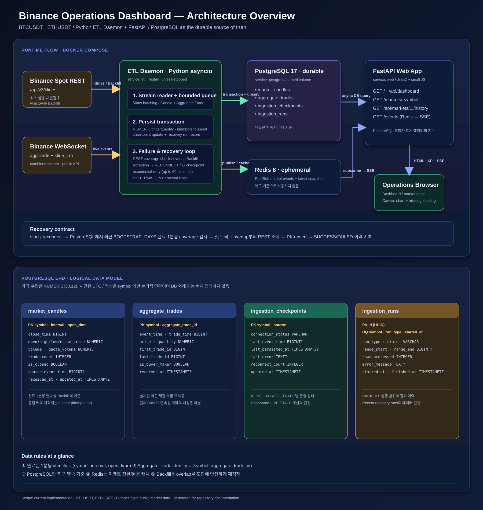

# Binance Operations Dashboard

Binance Spot의 `BTCUSDT`, `ETHUSDT` 실시간 시장 데이터를 수집하고, 수집 상태와
장애 뒤 데이터 복구 결과를 확인하는 내부 운영 대시보드입니다.

> 이 프로젝트는 주문 실행이나 투자 조언을 제공하지 않습니다. 공개 시장 데이터 수집기의
> 정상 동작, 데이터 신선도, 누락 구간 복구를 확인하는 데 목적이 있습니다.

## 1. 무엇을 실행하나요?

```text
Binance REST / WebSocket
            │
            ▼
      ETL Daemon (Python)
       │              │
       ▼              ▼
 PostgreSQL         Redis
       │              │
       └──── FastAPI Dashboard ──── Browser
```

### Architecture overview and ERD



원본 SVG는 확대해도 선명하며, [별도 탭에서 열어 보기](docs/assets/architecture-overview.svg)로
세부 필드와 복구 흐름을 확인할 수 있습니다.

Docker Compose는 아래 다섯 개의 서비스를 실행합니다.

| Service | 역할 | 정상 상태 |
|---|---|---|
| `postgres` | 캔들·체결·수집 상태·백필 이력 영속화 | `running (healthy)` |
| `redis` | ETL → Web 실시간 이벤트 전달, 최신 상태 캐시 | `running (healthy)` |
| `migrate` | Alembic DB schema migration 실행 | `exited (0)` — 정상 |
| `etl` | Binance 실시간 수집, Backfill, 재연결 | `running` |
| `web` | FastAPI Dashboard와 상태 조회 API | `running (healthy)` |

## 2. 사전 준비

처음 실행하기 전에 아래를 준비합니다.

- Docker 및 Docker Compose
- Binance 공개 API에 연결할 수 있는 인터넷 연결
- Windows PowerShell, macOS Terminal(zsh), Linux Terminal(bash 등)

Python은 모든 서비스를 Docker로 실행할 때 별도로 설치할 필요가 없습니다.

### 운영체제별 Docker 준비

| 환경 | 권장 설치 방식 | 실행 전 확인 |
|---|---|---|
| Windows | Docker Desktop + WSL 2 | Docker Desktop이 실행 중인지 확인 |
| macOS (Apple Silicon / Intel) | Docker Desktop for Mac | Docker Desktop을 실행하고 상태가 Running인지 확인 |
| Linux | Docker Engine + Compose plugin 또는 Docker Desktop for Linux | Docker daemon이 실행 중인지 확인 |

설치 절차는 Docker 공식 문서를 사용합니다.

- [Windows Docker Desktop 설치](https://docs.docker.com/desktop/setup/install/windows-install/)
- [macOS Docker Desktop 설치](https://docs.docker.com/desktop/setup/install/mac-install/)
- [Linux Docker Engine 설치](https://docs.docker.com/engine/install/)

모든 운영체제에서 터미널을 열어 아래 명령으로 Docker가 준비됐는지 확인합니다.

```bash
docker version
docker compose version
```

Windows·macOS에서 명령이 실패하면 Docker Desktop을 시작한 뒤 다시 실행합니다. Linux에서
`permission denied while trying to connect to the Docker daemon socket` 오류가 나면 Docker를
`sudo`로 실행하기보다 [Docker의 non-root 사용자 설정 안내](https://docs.docker.com/engine/install/linux-postinstall/)를
따르세요. `docker` 그룹은 root 수준 권한을 부여하므로 조직의 보안 정책도 함께 확인해야 합니다.

## 3. 최초 실행: 빠른 시작

프로젝트 루트(`binance-app`)에서 다음 순서대로 실행합니다.

### 3-1. 환경 변수 파일 만들기

`.env`는 저장소에 포함하지 않습니다. 사용자가 예시를 복사해 직접 관리합니다.

**Windows PowerShell**

```powershell
Copy-Item .env.example .env
notepad .env
```

**macOS / Linux (zsh 또는 bash)**

```bash
cp .env.example .env
# 선호하는 편집기로 .env를 엽니다. 예: nano .env
```

기본값으로도 실행할 수 있지만, `POSTGRES_PASSWORD`는 개인 개발 환경에 맞는 값으로 바꾸는 것을
권장합니다. `.env`를 Git에 추가하거나 공유하지 마세요.

> Docker Compose로 실행할 때 `DATABASE_URL`의 호스트는 `postgres`, `REDIS_URL`의 호스트는
> `redis`여야 합니다. 이는 Compose 내부 서비스 이름입니다.

### 3-2. 서비스 빌드 및 시작

```bash
docker compose up --build -d
```

처음 실행하면 Docker image 빌드와 최근 `BOOTSTRAP_DAYS`(기본 7일) 범위의 1분봉 Backfill이
진행됩니다. 처음에는 수십 초 이상 걸릴 수 있습니다.

### 3-3. 시작 상태 확인

```bash
docker compose ps
docker compose logs --tail 100 migrate
docker compose logs --tail 100 etl
docker compose logs --tail 100 web
```

정상적인 예시는 다음과 같습니다.

- `postgres`, `redis`, `web`은 `running` 또는 `healthy`
- `etl`은 `running`
- `migrate`는 schema 적용 후 `exited (0)`
- ETL log에 Backfill 시작·완료 또는 WebSocket 연결 관련 로그가 표시됨

서비스 상태를 계속 보려면 다음을 사용합니다. 종료는 `Ctrl + C`입니다.

```bash
docker compose logs -f etl web
```

## 4. Dashboard 사용 방법

서비스가 시작되면 브라우저에서 [http://localhost:8000](http://localhost:8000)을 엽니다.

### 화면에서 확인할 항목

| 영역 | 확인 방법 | 의미 |
|---|---|---|
| Pipeline health | 심볼·소스별 상태와 마지막 이벤트 시간 | Binance 이벤트가 ETL까지 들어오는지 확인 |
| Reconnects | 재연결 횟수 | 네트워크 또는 Binance 연결의 불안정성 확인 |
| Market status | 최신가, 24시간 변동률, candle lag | 수집 데이터의 최신성 확인 |
| 종목 상세 차트 | 1분봉, 거래량, 누락 구간, 최근 체결, 종목별 복구 이력 | 시간축의 실제 데이터 연속성과 실시간 갱신 확인 |
| Missing / hr | 최근 완료 1분봉 60개 중 누락 수 | 데이터 연속성 확인. 정상은 `0` |
| Recent recovery runs | Backfill 상태, 처리 행 수, 시작 시각 | 재시작·재연결 복구가 수행됐는지 확인 |

정상 운영에서는 수집 상태가 `LIVE`, 누락이 `0 missing / hr`에 가까운 상태여야 합니다.
초기 Backfill 또는 연결 복구 중에는 일시적으로 `RECOVERED` 또는 `RECONNECTING` 상태가
표시될 수 있습니다.

| 상태 | 의미 | 운영자 조치 |
|---|---|---|
| `LIVE` | 마지막 Binance 이벤트가 15초 이내에 수신됨 | 정상 감시 |
| `STALE` | ETL이 중지됐거나 마지막 이벤트가 15초를 초과함 | ETL 상태·로그 확인 후 재시작 |
| `RECONNECTING` | ETL이 Binance 연결을 재시도 중 | 재시도·Backfill 결과 확인 |
| `FAILED` | Backfill 또는 연결 처리 실패가 기록됨 | ETL 로그와 Binance API 접근 확인 |

헤더의 `실시간 이벤트 수신 중`도 모든 checkpoint가 `LIVE`일 때만 표시됩니다. 과거
`Recent recovery runs`의 `SUCCESS`는 마지막 Backfill이 성공했다는 이력일 뿐, 현재 ETL이
실행 중이라는 뜻은 아닙니다.

### 종목 상세 차트 보기

`Market status`의 BTCUSDT 또는 ETHUSDT 카드를 클릭하면 해당 종목의 상세 화면으로 이동합니다.
기본 구간은 6시간이며 `1시간`, `6시간`, `24시간`, `7일`로 변경할 수 있습니다.

- 캔들과 거래량은 PostgreSQL에 저장된 실제 1분봉입니다.
- 완료돼야 하지만 없는 1분봉은 주황색 음영으로 표시합니다. 차트를 위해 가격을 보간하지 않습니다.
- 현재 진행 중인 1분봉은 점선입니다. 완료 1분봉과 혼동하지 마세요.
- Redis/SSE는 새 데이터 도착을 알리고, 화면은 PostgreSQL API를 제한된 주기로 다시 조회합니다.
- 최근 체결과 해당 종목의 Backfill 이력도 함께 확인할 수 있습니다.

### 상태 API 확인

브라우저 대신 터미널에서도 상태를 확인할 수 있습니다.

**Windows PowerShell**

```powershell
Invoke-RestMethod http://localhost:8000/health
Invoke-RestMethod http://localhost:8000/api/dashboard | ConvertTo-Json -Depth 8
```

**macOS / Linux (zsh 또는 bash)**

```bash
curl -fsS http://localhost:8000/health
curl -fsS http://localhost:8000/api/dashboard
curl -fsS "http://localhost:8000/api/markets/BTCUSDT/history?window=6h"
```

- `/health`: Web이 PostgreSQL·Redis에 연결할 수 있는지 확인합니다.
- `/api/dashboard`: Dashboard에 표시하는 운영 데이터의 JSON입니다.
- `/markets/{symbol}`: 구성된 종목의 상세 차트 화면입니다. 예: `/markets/BTCUSDT`
- `/api/markets/{symbol}/history?window=1h|6h|24h|7d`: 상세 차트의 PostgreSQL 조회 API입니다.
- `/events`: 브라우저 갱신에 사용하는 Server-Sent Events(SSE) endpoint입니다.

## 5. 중지, 재시작, 종료

### 화면과 수집을 잠시 멈추기

컨테이너는 유지하고 프로세스만 중지합니다. 나중에 같은 데이터로 재개할 수 있습니다.

```bash
docker compose stop
docker compose start
```

### 컨테이너를 종료하기

컨테이너와 네트워크는 제거하지만 PostgreSQL·Redis 데이터 volume은 유지합니다.

```bash
docker compose down
```

다시 실행할 때는 다음 명령을 사용합니다. ETL은 마지막 완료 1분봉 이후의 누락 구간을
Backfill한 뒤 실시간 수집을 이어갑니다.

```bash
docker compose up -d
```

### ETL만 재시작해 Backfill 확인하기

복구 기능을 확인하려면 ETL만 최소 3분 중지한 뒤 다시 시작합니다.

```bash
docker compose stop etl
# 3분 이상 기다립니다.
docker compose start etl
docker compose logs --tail 150 etl
```

그 뒤 Dashboard에서 `Recent recovery runs`가 `SUCCESS`인지, 각 심볼의
`missing / hr`가 `0`인지 확인합니다.

### 모든 개발 데이터를 초기화하기

> 주의: 아래 명령은 이 프로젝트의 PostgreSQL·Redis named volume을 제거합니다. 지금까지
> 수집한 모든 로컬 이력이 삭제되며 되돌릴 수 없습니다.

```bash
docker compose down -v
```

그 다음 `docker compose up --build -d`를 실행하면 빈 DB 기준 최초 Backfill을 다시 수행합니다.

## 6. 환경 변수

`.env.example`을 기준으로 설정합니다. 기본값은 로컬 Docker Compose 실행용입니다.

| Variable | Default / example | 설명 |
|---|---|---|
| `POSTGRES_DB` | `binance_ops` | PostgreSQL DB 이름 |
| `POSTGRES_USER` | `binance_ops` | PostgreSQL 사용자 |
| `POSTGRES_PASSWORD` | `change-me` | PostgreSQL 비밀번호. 변경 권장 |
| `DATABASE_URL` | `postgresql+asyncpg://binance_ops:…@postgres:5432/binance_ops` | ETL·Web의 async DB 연결 문자열 |
| `REDIS_URL` | `redis://redis:6379/0` | Redis 연결 문자열 |
| `SYMBOLS` | `BTCUSDT,ETHUSDT` | 쉼표로 구분한 수집 심볼 |
| `KLINE_INTERVAL` | `1m` | 연속성 검증 기준 캔들 간격. 현재 `1m`만 지원 |
| `BOOTSTRAP_DAYS` | `7` | 빈 DB에서 처음 가져올 과거 완료 1분봉 일수 |
| `BACKFILL_OVERLAP_MINUTES` | `2` | 첫 누락 시점보다 앞서 다시 적재할 분 수 |
| `BINANCE_REST_URL` | `https://api.binance.com` | Binance Spot REST base URL |
| `BINANCE_WS_URL` | `wss://stream.binance.com:9443/stream` | Binance combined WebSocket stream URL |
| `WEB_HOST` | `0.0.0.0` | FastAPI bind host |
| `WEB_PORT` | `8000` | FastAPI container port |

## 7. 데이터 복구 방식

데이터 연속성의 기준은 **완료된 1분봉**입니다.

1. ETL이 시작하거나 WebSocket 연결이 복구됩니다.
2. 최근 `BOOTSTRAP_DAYS` 범위의 완료된 1분봉을 DB에서 검사합니다.
3. 첫 누락 시점보다 `BACKFILL_OVERLAP_MINUTES`만큼 앞선 지점부터 현재 마지막 완료 분봉까지
   Binance REST API로 다시 조회합니다.
4. `(symbol, interval, open_time)` 유니크 키 기반 upsert로 중복 없이 저장합니다.
5. 완료 결과를 `Recent recovery runs`와 Dashboard 상태에 기록합니다.

실시간 Aggregate Trade는 최근 체결 흐름을 위해 저장하며, 시간축의 연속성·Backfill 완료 여부는
1분봉으로 판정합니다.

## 8. 개발·검증 명령

코드 변경 뒤에는 프로젝트 루트에서 아래를 실행합니다. 이 명령은 Docker 실행과 별개로
로컬 Python 개발 환경을 준비할 때만 필요합니다.

**Windows PowerShell**

```powershell
python -m pip install -e .
ruff check .
pytest -q
python -m compileall -q app alembic
docker compose config --quiet
```

**macOS / Linux (zsh 또는 bash)**

```bash
python3 -m pip install -e .
ruff check .
pytest -q
python3 -m compileall -q app alembic
docker compose config --quiet
```

Docker 통합 검증은 [docs/checkpoints.md](docs/checkpoints.md)의 Fresh start, Process restart,
WebSocket recovery 시나리오를 따릅니다.

## 9. 문제 해결

### `docker compose up`이 Docker engine 연결 오류로 실패합니다

Docker Desktop이 실행 중인지 확인합니다. Windows에서 `dockerDesktopLinuxEngine` pipe 관련 오류는
대개 Docker Desktop이 꺼져 있거나 초기화 중일 때 발생합니다.

Linux에서 Docker Engine을 사용한다면 daemon 상태를 확인합니다.

```bash
sudo systemctl status docker
```

Docker daemon을 시작할 권한이 있는 환경이라면 `sudo systemctl start docker`로 시작한 뒤
`docker version`을 다시 실행합니다.

### `web`이 healthy가 되지 않거나 `/health`가 503을 반환합니다

먼저 의존 서비스와 migration 상태를 확인합니다.

```bash
docker compose ps
docker compose logs --tail 150 postgres redis migrate web
```

`migrate`가 `exited (0)`이 아닌 경우 DB schema 적용 실패 원인을 먼저 해결해야 합니다.

### `redis`가 `Bad file format reading the append only file`로 종료됩니다

비정상 종료 중 Redis AOF의 마지막 쓰기 일부가 손상된 경우입니다. 이 프로젝트에서 Redis는
실시간 전달·짧은 캐시 용도이고 PostgreSQL이 영속 데이터의 기준이므로, **PostgreSQL volume은
건드리지 않습니다.** 먼저 Redis volume을 별도 volume에 복제한 뒤 AOF를 복구합니다.

아래의 `binance-app_redis_data`는 현재 기본 Compose 프로젝트명 기준입니다. 다른 프로젝트명을
사용했다면 `docker volume ls`로 Redis volume의 실제 이름을 먼저 확인해 바꿉니다.

```bash
# 1) 원본 Redis volume 전체를 백업한다. 날짜·시간은 원하는 이름으로 바꾼다.
docker volume create binance-app_redis_aof_backup_YYYYMMDD
docker run --rm \
  -v binance-app_redis_data:/from:ro \
  -v binance-app_redis_aof_backup_YYYYMMDD:/to \
  redis:8-alpine sh -c 'cp -a /from/. /to/'

# 2) 백업을 보존한 원본에서만 손상된 AOF 꼬리를 정리한다.
docker run --rm \
  -v binance-app_redis_data:/data \
  redis:8-alpine sh -c 'yes y | redis-check-aof --fix /data/appendonlydir/appendonly.aof.manifest'

# 3) Redis와 의존 앱을 다시 시작하고 상태를 확인한다.
docker compose start redis
docker compose up -d etl web
docker compose exec -T redis redis-cli ping
docker compose ps
```

정상 복구 시 `PONG`이 출력됩니다. ETL이 다시 시작되면 PostgreSQL의 마지막 완료 캔들부터
자동 Backfill하므로, Dashboard에서 `missing / hr = 0`, checkpoint `LIVE`를 확인합니다.
`redis-check-aof --fix`는 손상된 마지막 명령을 버릴 수 있으므로 반드시 1단계 백업을 먼저
수행해야 합니다.

### Dashboard에 데이터가 없거나 ETL이 계속 재연결됩니다

ETL log를 확인합니다.

```bash
docker compose logs -f etl
```

Binance API 접근이 네트워크·지역·방화벽 정책으로 차단됐는지, `.env`의 Binance URL이 올바른지,
그리고 초기 Backfill이 아직 진행 중인지 확인합니다.

### `localhost:8000` 포트를 이미 사용 중입니다

사용 중인 프로세스를 종료하거나 `compose.yaml`의 `web.ports`에서 호스트 포트를 변경합니다.
예를 들어 `"8080:8000"`으로 바꾸면 Dashboard 주소는 `http://localhost:8080`이 됩니다.

## Related documents

- [프로젝트 방향·목표·완료 정의](docs/project-plan.md)
- [체크포인트와 통합 검증 시나리오](docs/checkpoints.md)
- [작업·데이터·commit 규칙](docs/project-rules.md)
- [기술 선택 근거와 작업 전 점검표](docs/preflight-decisions.md)
- [Dashboard 지표 정의](docs/metrics.md)
- [다른 AI Agent를 위한 handoff guide](AGENTS.md)
